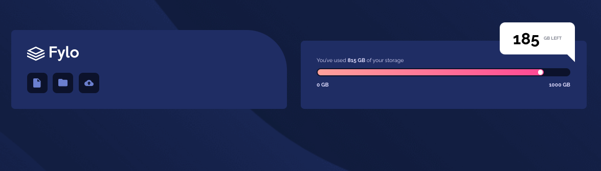

# Frontend Mentor - Fylo data storage component solution

This is a solution to the [Fylo data storage component challenge on Frontend Mentor](https://www.frontendmentor.io/challenges/fylo-data-storage-component-1dZPRbV5n).

## Table of contents

- [Overview](#overview)
  - [The challenge](#the-challenge)
  - [Screenshot](#screenshot)
  - [Links](#links)
- [My process](#my-process)
  - [Built with](#built-with)
  - [What I learned](#what-i-learned)
  - [Continued development](#continued-development)
  - [Useful resources](#useful-resources)
- [Author](#author)
- [Acknowledgments](#acknowledgments)

### The challenge

Users should be able to:

- View the optimal layout for the site depending on their device's screen size

### Screenshot

### Links

- Solution URL: [https://github.com/Peteonthebeat/Fylo-Data-Storage-Component]
- Live Site URL: [https://peteonthebeat.github.io/Fylo-Data-Storage-Component/]

### Built with

- Semantic HTML5 markup
- CSS custom properties
- Flexbox
- CSS Grid
- Mobile-first workflow

### What I learned

The main thing I learned is using CSS triangles from various css generators. I also got exercise some basic flexbox and grid skills.

.white-box::after {
content: "";
position: absolute;
bottom: -20px;

    right: 0;
    /* left: calc(50% - 20px); */
    border-style: solid;
    border-width: 0 25px 25px 0;
    border-color: transparent white transparent transparent;

}

### Continued development

Use this section to outline areas that you want to continue focusing on in future projects. These could be concepts you're still not completely comfortable with or techniques you found useful that you want to refine and perfect.

### Useful resources

- [https://csstriangle.firebaseapp.com/#/](https://www.example.com) - This is the CSS triangle generator I used for the white bubble.

## Author

- Website - [Peteonthebeat](peteonthebeat.com)
- Frontend Mentor - [@peteonthebeat](https://www.frontendmentor.io/profile/peteonthebeat)

## Acknowledgments

Shout out to my girl who suggested me to use CSS triangle generator.
